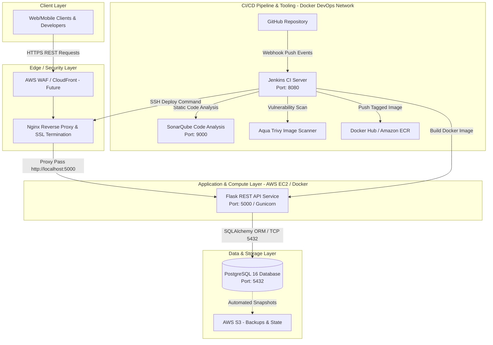

# Enterprise Employee Management CI/CD Platform

      

An enterprise-grade DevOps platform demonstrating modern continuous integration, automated vulnerability scanning, quality gates, containerization, and cloud deployment practices for a Python Flask REST API backed by PostgreSQL and JWT authentication.

---

## 🏛️ Executive Summary

The **Enterprise Employee Management CI/CD Platform** is designed to showcase how modern software engineering teams build, test, containerize, analyze, deploy, and monitor production-ready microservices. Rather than focusing solely on application CRUD logic, this platform implements a robust, secure, and automated **DevOps delivery pipeline** adhering to industry best practices established by top-tier engineering organizations (Google, Amazon, Microsoft, Netflix, and OpenAI).

---

## 🚀 Key Features & DevOps Highlights

- **Backend Application**: Production-styled RESTful API built with Python 3.12, Flask 3.1.1, and SQLAlchemy ORM, organized with clean architecture principles (Models, Services, Repositories, Schemas).
- **Security & Authentication**: Token-based authentication using `Flask-JWT-Extended` and password hashing with `Flask-Bcrypt`.
- **Database Management**: PostgreSQL 16 containerized instance with automated schema migrations via `Flask-Migrate` (Alembic).
- **Containerization**: Optimized, multi-stage capable Docker build using slim Python images, secure non-root user targets, and embedded `pg_isready` health checks.
- **Continuous Integration (CI)**: Fully declarative **Jenkins Pipeline (`Jenkinsfile`)** integrating automated code checkouts, Docker builds, static code analysis (**SonarQube**), strict **Quality Gates**, and container vulnerability scanning (**Aqua Security Trivy**).
- **DevOps Tooling Stack**: Dedicated `docker-compose.devops.yml` provisioning local CI/CD infrastructure (Jenkins LTS, SonarQube Community LTS, and Trivy security cache).
- **Cloud Readiness**: Architecture designed for high-availability AWS deployment on EC2 Ubuntu servers behind Nginx reverse proxies, with future migration paths to **Amazon EKS (Kubernetes)**, **Terraform Infrastructure as Code (IaC)**, and **Prometheus/Grafana Observability**.

---

## 📐 System Architecture Overview



---

## 📁 Repository Navigation & Documentation Sitemap

To navigate this comprehensive enterprise project, detailed technical documentation has been organized into modular guides:

| Document | Description | Path |
| :--- | :--- | :--- |
| **Complete Architecture Guide** | Deep dive into system design, network topography, data flows, and security model. | [`docs/ARCHITECTURE.md`](docs/ARCHITECTURE.md) |
| **CI/CD Pipeline Breakdown** | Stage-by-stage analysis of the `Jenkinsfile`, SonarQube quality gates, and Trivy scans. | [`docs/CI_CD_PIPELINE.md`](docs/CI_CD_PIPELINE.md) |
| **Folder & File Anatomy** | Line-by-line breakdown of every file, module, configuration, and directory. | [`docs/FOLDER_STRUCTURE.md`](docs/FOLDER_STRUCTURE.md) |
| **Technology Stack Specification** | Rationale and best practices for Python, Flask, PostgreSQL, Docker, Jenkins, and AWS. | [`docs/TECH_STACK.md`](docs/TECH_STACK.md) |
| **Production Deployment Guide** | Step-by-step instructions for deploying to AWS EC2 Ubuntu with Nginx and Docker Compose. | [`docs/DEPLOYMENT_GUIDE.md`](docs/DEPLOYMENT_GUIDE.md) |
| **SRE Troubleshooting Guide** | Incident response playbooks, debugging steps, and root-cause analysis for common failures. | [`docs/TROUBLESHOOTING_GUIDE.md`](docs/TROUBLESHOOTING_GUIDE.md) |
| **Enterprise Roadmap** | Phase-by-phase evolution plan covering Terraform, EKS, Helm, ArgoCD, and ELK Stack. | [`docs/PROJECT_ROADMAP.md`](docs/PROJECT_ROADMAP.md) |
| **Resume & Portfolio Guide** | ATS-optimized bullet points and technical presentation summaries for engineering roles. | [`docs/RESUME_PROJECT_DESCRIPTION.md`](docs/RESUME_PROJECT_DESCRIPTION.md) |
| **Interview Preparation** | 30+ Senior DevOps and SRE interview questions with detailed, authoritative answers. | [`docs/INTERVIEW_QUESTIONS.md`](docs/INTERVIEW_QUESTIONS.md) |
| **Enterprise Improvements & Evaluation** | Architecture evaluation, vulnerability remediation, and 2026 Senior Interviewer critique. | [`docs/ENTERPRISE_IMPROVEMENTS_AND_EVALUATION.md`](docs/ENTERPRISE_IMPROVEMENTS_AND_EVALUATION.md) |

---

## ⚡ Quick Start Guide (Local Development)

### Prerequisites
- [Docker Desktop](https://www.docker.com/products/docker-desktop/) installed and running (with Compose V2).
- [Git](https://git-scm.com/) version control.

### 1. Clone the Repository
```bash
git clone https://github.com/Aditya-Singh0906/employee-management-cicd.git
cd employee-management-cicd
```

### 2. Configure Environment Variables
Copy the sample environment configuration file inside `application/`:
```bash
cp application/.env.example application/.env
```

### 3. Launch Application Stack (API + PostgreSQL)
Run the application and persistent database services using Docker Compose:
```bash
docker compose up -d --build
```
Check status of running containers:
```bash
docker compose ps
```
The API is now live at: `http://localhost:5000/api/v1/health`

### 4. Launch CI/CD DevOps Stack (Jenkins + SonarQube + Trivy)
To spin up the entire local CI/CD infrastructure on isolated network `devops`:
```bash
docker compose -f docker-compose.devops.yml up -d
```
- **Jenkins UI**: `http://localhost:8080` (Retrieve initial admin password: `docker exec -it jenkins cat /var/jenkins_home/secrets/initialAdminPassword`)
- **SonarQube UI**: `http://localhost:9000` (Default credentials: `admin` / `admin`)

---

## 🔌 API Endpoints Summary

All endpoints are prefixed under `/api/v1` (or custom registered blueprint paths):

| Method | Endpoint | Description | Authentication |
| :--- | :--- | :--- | :--- |
| `GET` | `/api/v1/health` | Service health and version validation check | Public |
| `POST` | `/api/v1/auth/register` | Register a new user account | Public |
| `POST` | `/api/v1/auth/login` | Authenticate and retrieve JWT access token | Public |
| `GET` | `/api/v1/employees` | Retrieve paginated list of all employees | JWT Required |
| `POST` | `/api/v1/employees` | Create a new employee record | JWT Required |
| `GET` | `/api/v1/employees/<id>` | Get details of a specific employee | JWT Required |
| `PUT` | `/api/v1/employees/<id>` | Update an existing employee record | JWT Required |
| `DELETE`| `/api/v1/employees/<id>` | Remove an employee record from PostgreSQL | JWT Required (Admin) |

---

## 🛠️ Environment Configuration Table

| Variable Name | Default / Example | Description |
| :--- | :--- | :--- |
| `FLASK_ENV` | `development` | Controls Flask configuration profile (`development`, `testing`, `production`). |
| `SECRET_KEY` | `super-secret` | Cryptographic secret for Flask session management and CSRF protection. |
| `JWT_SECRET_KEY` | `jwt-secret` | Secret key used by `Flask-JWT-Extended` to sign and verify JWT tokens. |
| `DATABASE_URL` | `postgresql://postgres:postgres@db:5432/employee_db` | SQLAlchemy database connection string targeting the PostgreSQL container (`db`). |
| `LOG_LEVEL` | `INFO` | Logging threshold for application logs (`application/logs/application.log`). |

---

## 📜 License & Acknowledgments

This enterprise project structure is developed for educational, architectural demonstration, and engineering portfolio validation purposes under the **MIT License**.
