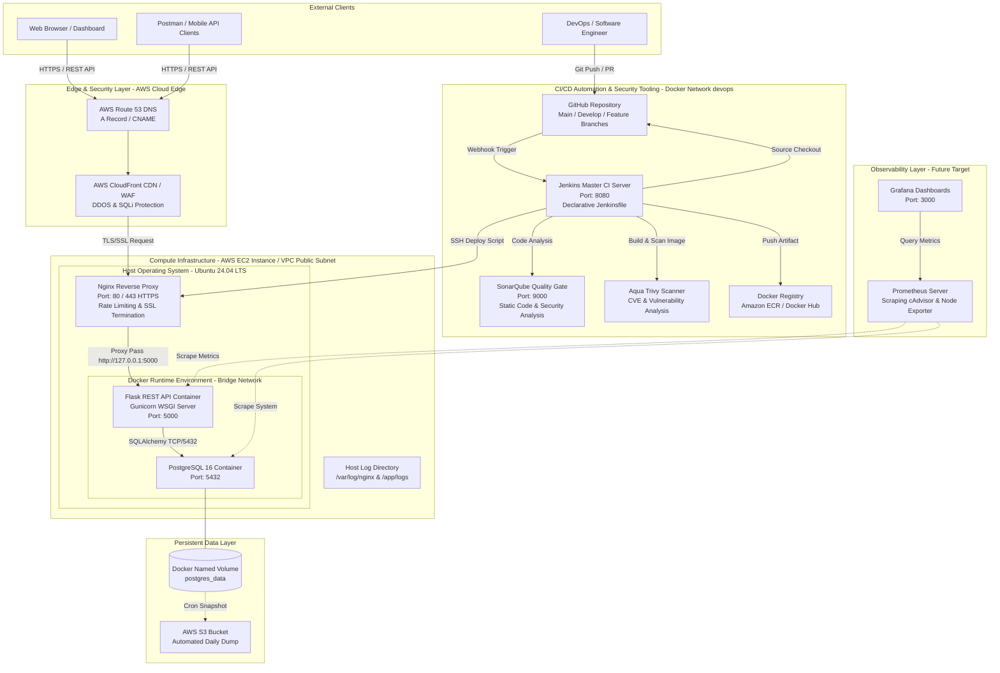
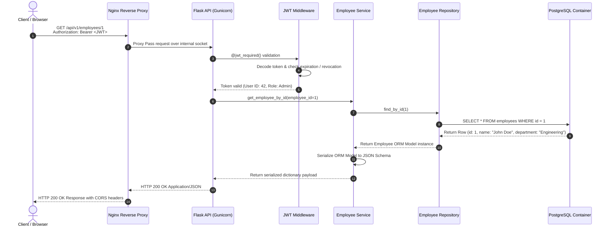

# Enterprise Architecture Guide

## 1. Architectural Overview & Design Philosophy

The **Enterprise Employee Management CI/CD Platform** is engineered according to enterprise cloud-native design principles: **Separation of Concerns**, **High Availability (HA)**, **Zero-Trust Security Edge**, **Immutable Infrastructure**, and **Automated Quality Verification**.

In a production-tier architecture, the application logic is completely decoupled from the underlying storage and orchestration layers. The system is designed around a clean 3-tier model deployed in Docker containers and managed via CI/CD automation.

---

## 2. Comprehensive System Architecture Diagram

---

## 3. Layer-by-Layer Architectural Analysis

### 3.1 Edge & Network Security Layer
- **DNS (AWS Route 53)**: Routes external domain traffic (`api.company.internal`) with health-check-enabled failover routing policies.
- **Reverse Proxy (Nginx)**: Acts as the single entry point (`0.0.0.0:80/443`) into the compute environment. It handles TLS/SSL termination, HTTP-to-HTTPS redirection, request buffering, client payload size restriction (`client_max_body_size 10M`), and rate limiting to prevent denial-of-service attempts before hitting the WSGI layer.

### 3.2 Application & Compute Layer
- **WSGI Process Management**: The application inside the Docker container is executed using Gunicorn (Green Unicorn) or WSGI workers behind Flask. This prevents Flask’s built-in single-threaded development server (`run.py`) from buckling under concurrent production requests.
- **Application Structure**: Implements the **Repository Pattern** and **Service Layer Pattern**:
  - **Controllers/API Blueprints (`app/api/`)**: Handle HTTP request parsing, input validation via `Marshmallow`/`Pydantic` schemas, and HTTP status code formatting.
  - **Services (`app/services/`)**: Encapsulate pure business logic, transactional boundaries, and domain rules.
  - **Repositories (`app/repositories/`)**: Isolate database queries and ORM interactions (`SQLAlchemy`) so the domain model remains completely decoupled from raw database calls.
  - **Models (`app/models/`)**: Define declarative database entities and relationships (`Employee`, `User`).

### 3.3 Data & Persistence Layer
- **Relational Engine**: PostgreSQL 16 running inside an isolated Docker container or managed AWS RDS instance.
- **Volume Isolation**: Uses Docker named volumes (`postgres_data`) mapped directly to `/var/lib/postgresql/data` within the container. This guarantees that container restarts or upgrades do not result in data loss.
- **Schema Migrations**: Controlled entirely through **Alembic (`Flask-Migrate`)**. Database schemas (`alembic_version` tracking table) are strictly versioned, ensuring zero-downtime forward and backward compatibility across deployments.

### 3.4 Continuous Integration & Delivery (CI/CD) Layer
- **Isolation**: Jenkins and code quality tools execute on a dedicated Docker bridge network (`devops`), completely segmented from public-facing production containers.
- **Vulnerability Inspection**: Every container artifact produced (`employee-management-api:${BUILD_NUMBER}`) is scanned locally using **Aqua Security Trivy** against OS-level CVE databases and Python package vulnerabilities before pushing to the remote Docker registry (Amazon ECR / Docker Hub).

---

## 4. End-to-End Request Data Flow

Let us trace what happens when an authenticated client requests `GET /api/v1/employees/1`:

---

## 5. Security Architecture & Threat Mitigation

1. **Least Privilege Principle**:
   - The Flask API container runs as a non-root user (`USER appuser`) defined in the multi-stage build.
   - Database user `postgres` restricts access strictly to the `employee_db` schema.
2. **Network Segmentation**:
   - Only `Nginx` exposes ports (`80/443`) to the external host/network.
   - Flask (`5000`) and PostgreSQL (`5432`) bind strictly to the private internal Docker bridge network (`docker-compose.yml`), making direct external port scans against the database impossible.
3. **Secret Management**:
   - No hardcoded secrets (`JWT_SECRET_KEY`, `POSTGRES_PASSWORD`) reside inside source code or image layers.
   - Secrets are injected dynamically at container startup via secure `.env` files or AWS Secrets Manager / Parameter Store integration.
