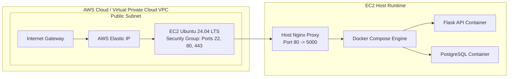

# Production AWS EC2 Deployment Guide

This guide details the step-by-step procedures required to provision, configure, and deploy the **Enterprise Employee Management CI/CD Platform** to a production AWS EC2 Ubuntu Linux instance running behind an Nginx reverse proxy.

---

## 1. AWS Cloud Infrastructure Architecture



---

## 2. Step 1: AWS EC2 Instance Provisioning & Security Groups

1. **Launch Instance**:
   - **AMI**: Ubuntu Server 24.04 LTS (HVM), SSD Volume Type.
   - **Instance Type**: `t3.medium` (2 vCPU, 4 GB RAM minimum recommended for running Docker build engines and database containers simultaneously).
   - **Key Pair**: Generate an SSH Key Pair (`devops-prod-key.pem`) and download it to your local environment.
2. **Configure Security Group (`devops-prod-sg`)**:
   Enforce strict ingress firewall restrictions:

| Inbound Port | Protocol | Source / CIDR Range | Description |
| :--- | :--- | :--- | :--- |
| `22` | TCP | `<Your-Office-IP>/32` | SSH administrative access (Restricted to VPN / Bastion). |
| `80` | TCP | `0.0.0.0/0` | Standard HTTP ingress (redirects to HTTPS in production). |
| `443`| TCP | `0.0.0.0/0` | Secure HTTPS TLS ingress. |
| `5000` | TCP | `127.0.0.1/32` | Internal Flask API (Blocked externally; accessed via Nginx only). |

3. **Elastic IP Allocation**:
   - Allocate a static AWS Elastic IP address and associate it with the newly created EC2 instance to prevent IP drift across server reboots.

---

## 3. Step 2: Host Operating System Preparation & Docker Installation

SSH into the newly provisioned Ubuntu server:
```bash
chmod 400 devops-prod-key.pem
ssh -i devops-prod-key.pem ubuntu@<AWS-ELASTIC-IP>
```

Update system repositories and install required host utilities:
```bash
sudo apt-get update && sudo apt-get upgrade -y
sudo apt-get install -y ca-certificates curl gnupg lsb-release git nginx
```

Install official Docker Engine and Docker Compose V2:
```bash
# Add Docker official GPG key
sudo mkdir -p /etc/apt/keyrings
curl -fsSL https://download.docker.com/linux/ubuntu/gpg | sudo gpg --dearmor -o /etc/apt/keyrings/docker.gpg

# Set up stable repository
echo \
  "deb [arch=$(dpkg --print-architecture) signed-by=/etc/apt/keyrings/docker.gpg] https://download.docker.com/linux/ubuntu \
  $(lsb_release -cs) stable" | sudo tee /etc/apt/sources.list.d/docker.list > /dev/null

sudo apt-get update
sudo apt-get install -y docker-ce docker-ce-cli containerd.io docker-compose-plugin

# Grant non-root user access to Docker daemon
sudo usermod -aG docker ubuntu
newgrp docker
```

---

## 4. Step 3: Application Deployment via Git & Docker Compose

Clone the repository into `/opt/employee-management`:
```bash
sudo mkdir -p /opt/employee-management && sudo chown ubuntu:ubuntu /opt/employee-management
cd /opt/employee-management
git clone https://github.com/Aditya-Singh0906/employee-management-cicd.git .
```

Provision production environment secrets (`application/.env`):
```bash
cat <<EOF > application/.env
FLASK_ENV=production
SECRET_KEY=$(openssl rand -hex 32)
JWT_SECRET_KEY=$(openssl rand -hex 32)
DATABASE_URL=postgresql://postgres:SecureProdPassword2026!@db:5432/employee_db
LOG_LEVEL=INFO
EOF
```

Update `docker-compose.yml` environment block to reference secure passwords, then launch the stack:
```bash
docker compose up -d --build
```
Verify container health:
```bash
docker compose ps
docker logs -f employee-api
```

---

## 5. Step 4: Nginx Reverse Proxy & SSL Configuration

Configure Nginx on the host operating system to act as a secure gateway buffering traffic to the internal Docker container (`localhost:5000`):

Create `/etc/nginx/sites-available/employee-api`:
```nginx
server {
    listen 80;
    server_name api.company.internal <AWS-ELASTIC-IP>;

    # Security headers
    add_header X-Frame-Options "SAMEORIGIN";
    add_header X-XSS-Protection "1; mode=block";
    add_header X-Content-Type-Options "nosniff";

    client_max_body_size 10M;

    location / {
        proxy_pass http://127.0.0.1:5000;
        proxy_http_version 1.1;
        proxy_set_header Upgrade $http_upgrade;
        proxy_set_header Connection 'upgrade';
        proxy_set_header Host $host;
        proxy_cache_bypass $http_upgrade;
        
        # Real client IP forwarding
        proxy_set_header X-Real-IP $remote_addr;
        proxy_set_header X-Forwarded-For $proxy_add_x_forwarded_for;
        proxy_set_header X-Forwarded-Proto $scheme;

        # Timeout tuning
        proxy_connect_timeout 60s;
        proxy_send_timeout 60s;
        proxy_read_timeout 60s;
    }
}
```

Enable the site configuration and restart Nginx:
```bash
sudo ln -s /etc/nginx/sites-available/employee-api /etc/nginx/sites-enabled/
sudo rm -f /etc/nginx/sites-enabled/default
sudo nginx -t
sudo systemctl restart nginx
```

---

## 6. Step 5: Automated SSH Deployment via CI/CD (Jenkins Hand-off)

To allow Jenkins to automatically deploy new Docker images to this EC2 instance upon successful pipeline execution:

1. Store the EC2 SSH private key inside Jenkins (`Manage Jenkins -> Credentials -> Add Credentials -> SSH Username with private key`). Assign ID `aws-ec2-ssh-key`.
2. Append the following deployment stage to `jenkins/Jenkinsfile`:

```groovy
stage('Deploy to AWS EC2') {
    steps {
        sshagent(['aws-ec2-ssh-key']) {
            sh '''
                ssh -o StrictHostKeyChecking=no ubuntu@<AWS-ELASTIC-IP> << 'EOF'
                    cd /opt/employee-management
                    git pull origin main
                    docker compose down
                    docker rmi -f employee-management-api:latest || true
                    docker compose up -d --build
                    docker image prune -f
EOF
            '''
        }
    }
}
```
