# Technology Stack & Engineering Rationale

This document details every technology selected across the application, database, containerization, orchestration, CI/CD, cloud, monitoring, logging, and security layers of the **Enterprise Employee Management CI/CD Platform**. It explains the engineering justification behind each architectural decision.

---

## 1. Complete Technology Stack Matrix

| Layer / Category | Technology Selected | Version | Purpose in Architecture | Justification & Best Practices |
| :--- | :--- | :--- | :--- | :--- |
| **Backend Language** | Python | 3.12 | Core application programming language | High developer productivity, rich ecosystem of cloud SDKs (`boto3`), excellent support for data validation and enterprise REST API frameworks. |
| **Web Framework** | Flask | 3.1.1 | WSGI REST API application framework | Lightweight, modular, and unopinionated. Allows strict implementation of clean enterprise architecture (Repository/Service patterns) without framework bloat. |
| **Database Engine** | PostgreSQL | 16 | ACID-compliant relational data store | Industry gold standard for enterprise data reliability, robust JSON processing, concurrent MVCC locking, and advanced indexing capabilities. |
| **ORM & Migrations**| SQLAlchemy & Alembic | 3.1.1 / 4.1.0 | Object-Relational Mapping & Schema Versioning | Eliminates raw SQL vulnerabilities (SQL injection) and guarantees repeatable, immutable database schema evolution across environments. |
| **WSGI Server** | Gunicorn | 23.0.0 | High-concurrency production WSGI server | Manages multi-process worker pools (`--workers 4`) to handle high-throughput concurrent HTTP requests behind Nginx reverse proxies. |
| **Container Engine** | Docker & Compose | V2 | Application & dependency containerization | Ensures complete parity across Dev, CI, and Production environments by packaging OS libraries, runtime, and code into immutable artifacts. |
| **CI Automation** | Jenkins LTS | LTS JDK 17 | Continuous Integration automation server | Industry-proven, highly extensible orchestration server capable of running complex Declarative Pipelines with Docker-in-Docker isolation. |
| **Code Quality** | SonarQube | Community LTS | Static Code Analysis & Quality Gate | Automated detection of code smells, reliability bugs, cyclomatic complexity, and security vulnerabilities before artifact generation. |
| **Image Security** | Aqua Trivy | Latest | Container & OS vulnerability scanning | Fast, stateless, and thorough scanning of container image layers (`OS packages` + `requirements.txt`) against real-time CVE feeds. |
| **Cloud Compute** | AWS EC2 (Ubuntu) | Ubuntu 24.04 | Virtual machine compute infrastructure | Reliable, resizable cloud compute instances running Linux kernel optimized for Docker engine orchestration. |
| **Reverse Proxy** | Nginx | Latest | Edge reverse proxy & TLS termination | High-performance edge server handling SSL/TLS encryption, static request buffering, HTTP-to-HTTPS redirect, and DDoS rate limiting. |
| **Authentication** | Flask-JWT-Extended | 4.7.1 | Token-based stateless authentication | Implements secure, stateless JSON Web Tokens with support for role-based claims (`role: admin`), expiration, and refresh mechanisms. |

---

## 2. Detailed Architectural Selection Rationale

### 2.1 Why Python & Flask over Django or FastAPI?
- **Flask vs. Django**: While Django provides an all-in-one monolith architecture with built-in admin panels and tightly coupled ORM, Flask provides the exact architectural flexibility required for enterprise microservices. It allows engineers to construct distinct domain layers (`Repositories`, `Services`, `Controllers`) without enforcing rigid monolithic folder structures.
- **Flask vs. FastAPI**: While FastAPI excels at async I/O and auto-generated OpenAPI schemas, Flask remains the most battle-tested WSGI framework in legacy and modern enterprise environments, boasting unmatched stability, comprehensive security extensions (`Flask-JWT-Extended`, `Flask-Bcrypt`), and extensive community support.

### 2.2 Why PostgreSQL over MySQL or MongoDB?
- **Relational Integrity**: Employee and user management domains require strict ACID compliance, foreign key enforcement, and transactional consistency—making NoSQL document stores (`MongoDB`) a suboptimal choice due to lack of strong relational constraints.
- **PostgreSQL vs. MySQL**: PostgreSQL 16 outperforms MySQL in handling complex subqueries, concurrent table modifications via MVCC (Multi-Version Concurrency Control), and native support for advanced data types (`JSONB`, `UUID`), making it the preferred enterprise database for cloud-native deployments.

### 2.3 Why Jenkins over GitHub Actions?
- While **GitHub Actions** is widely used for cloud-hosted SaaS pipelines, **Jenkins LTS** remains the primary choice for hybrid and on-premise enterprise environments (Google, Amazon, and legacy banking infrastructures).
- Jenkins offers total governance over build agents, deep integration with custom internal security tools, and fine-grained control over pipeline execution environments via self-hosted Docker-in-Docker networks.

### 2.4 Why Aqua Trivy over Clair or Anchore?
- **Trivy** is selected for container scanning because of its speed, zero-database-maintenance architecture, and high accuracy across both OS-level package managers (`apt`, `apk`) and application-level dependency manifests (`requirements.txt`). Its ability to run in a stateless container with cached volume mounts (`trivy-cache`) makes it ideal for CI/CD pipelines.

---

## 3. Future Target Stack Additions

To elevate this platform to a Kubernetes-native cloud ecosystem, the following additions are mapped out in the project roadmap:

```mermaid
graph LR
    subgraph Current Stack
        EC2[AWS EC2 Ubuntu]
        Compose[Docker Compose]
        Jenkins[Jenkins Pipeline]
    end

    subgraph Future Target Stack
        EKS[Amazon EKS Kubernetes]
        Helm[Helm Chart Packaging]
        Argo[ArgoCD GitOps Delivery]
        TF[Terraform IaC State]
        Prom[Prometheus & Grafana]
    end

    Compose -->|Container Migration| EKS
    Compose -->|Template Packaging| Helm
    Jenkins -->|CD Automation Hand-off| Argo
    EC2 -->|Declarative Provisioning| TF
```

