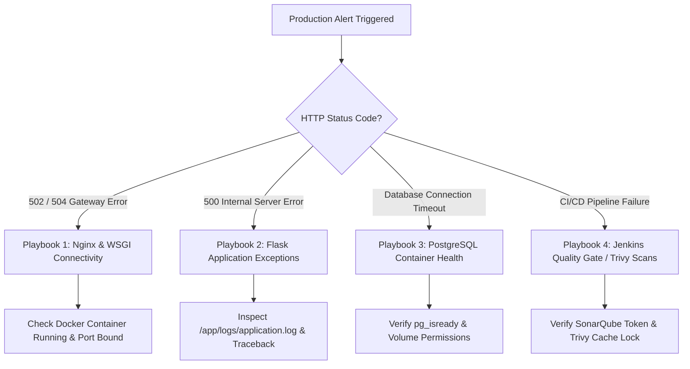

# Site Reliability Engineering (SRE) Troubleshooting & Playbook Guide

This document defines standard operating procedures and diagnostic playbooks for Site Reliability Engineers (SREs) and DevOps engineers responding to production incidents within the **Enterprise Employee Management CI/CD Platform**.

---

## 1. Incident Diagnostic Tree



---

## 2. Production Playbooks

### Playbook 1: Nginx Returns `502 Bad Gateway` or `504 Gateway Timeout`
- **Root Cause**: Nginx cannot establish a TCP connection to the Flask WSGI container on `127.0.0.1:5000`, or the WSGI worker pool is exhausted and failing to respond within the `proxy_read_timeout` window.
- **Diagnostic Steps**:
  1. Check Nginx error logs on the EC2 host:
     ```bash
     sudo tail -n 50 /var/log/nginx/error.log
     ```
  2. Verify if the `employee-api` container is running and healthy:
     ```bash
     docker compose ps
     ```
  3. Inspect container runtime output for crash loops:
     ```bash
     docker logs --tail 100 employee-api
     ```
- **Remediation**:
  - If container exited due to memory exhaustion (`OOMKilled: true`), increase EC2 instance size or tune Gunicorn worker limits inside `application/Dockerfile` (`--workers 2 --threads 2`).
  - If container is stuck in `Restarting`, verify that the `db` container is healthy and responding on port `5432`.

---

### Playbook 2: PostgreSQL Database Connection Failure (`OperationalError`)
- **Root Cause**: The Flask API attempts to execute SQLAlchemy ORM queries before the database container finishes initializing, or credentials in `DATABASE_URL` do not match `POSTGRES_PASSWORD`.
- **Diagnostic Steps**:
  1. Test PostgreSQL readiness from the host terminal:
     ```bash
     docker exec -it employee-db pg_isready -U postgres -d employee_db
     ```
  2. Inspect database server initialization logs:
     ```bash
     docker logs employee-db | grep -i "error\|fatal"
     ```
- **Remediation**:
  - Ensure `docker-compose.yml` utilizes the strict healthcheck dependency condition:
    ```yaml
    depends_on:
      db:
        condition: service_healthy
    ```
  - If data corruption occurs inside `postgres_data`, perform an emergency restore from the latest automated S3 snapshot using `pg_restore`.

---

### Playbook 3: Jenkins Pipeline Aborted at `Quality Gate` Stage
- **Root Cause**: SonarQube static analysis detected new blocking issues (e.g., Critical security hotspots, test coverage dropping below threshold, or duplicated code blocks exceeding limits).
- **Diagnostic Steps**:
  1. Access SonarQube UI (`http://<server>:9000`) -> Navigate to `employee-management-cicd` project -> Click **Quality Gate Status**.
  2. Inspect specific blocking conditions (e.g., `New Vulnerabilities > 0` or `Coverage on New Code < 80%`).
- **Remediation**:
  - Do **NOT** force override the pipeline in production.
  - Review SonarQube exact line flags, remediate the code smell or vulnerability in the feature branch, add missing unit tests in `application/tests/unit`, and push a new commit to trigger a fresh build.

---

### Playbook 4: Trivy Image Scan Blocks Build (`CVE-XXXX-XXXX`)
- **Root Cause**: Aqua Trivy identified High/Critical Common Vulnerabilities and Exposures inside base Debian/Ubuntu OS libraries or Python dependencies (`requirements.txt`).
- **Diagnostic Steps**:
  1. Inspect Jenkins console output under `Trivy Image Scan` stage to identify exact CVE identifiers and affected libraries.
- **Remediation**:
  - For Python package vulnerabilities: Update exact pinned versions in `application/requirements.txt` (`Flask-Cors==6.0.1 -> latest patched release`).
  - For OS base vulnerabilities: Update base image inside `application/Dockerfile` from `python:3.12-slim` to `python:3.12-slim-bookworm` or run `apt-get update && apt-get upgrade -y` inside a custom hardened base layer.

---

### Playbook 5: JWT Authentication Errors (`401 Unauthorized` / `Token Expired`)
- **Root Cause**: `Flask-JWT-Extended` secret mismatch (`JWT_SECRET_KEY`) between deployed API instances, or system clock drift on the EC2 host causing token signature verification failures.
- **Diagnostic Steps**:
  1. Check host system clock alignment:
     ```bash
     timedatectl status
     ```
  2. Verify that `JWT_SECRET_KEY` matches across all `.env` configuration files.
- **Remediation**:
  - Synchronize host clock via NTP (`sudo systemctl restart chrony`).
  - Instruct clients to clear stale bearer tokens and re-authenticate via `POST /api/v1/auth/login`.
